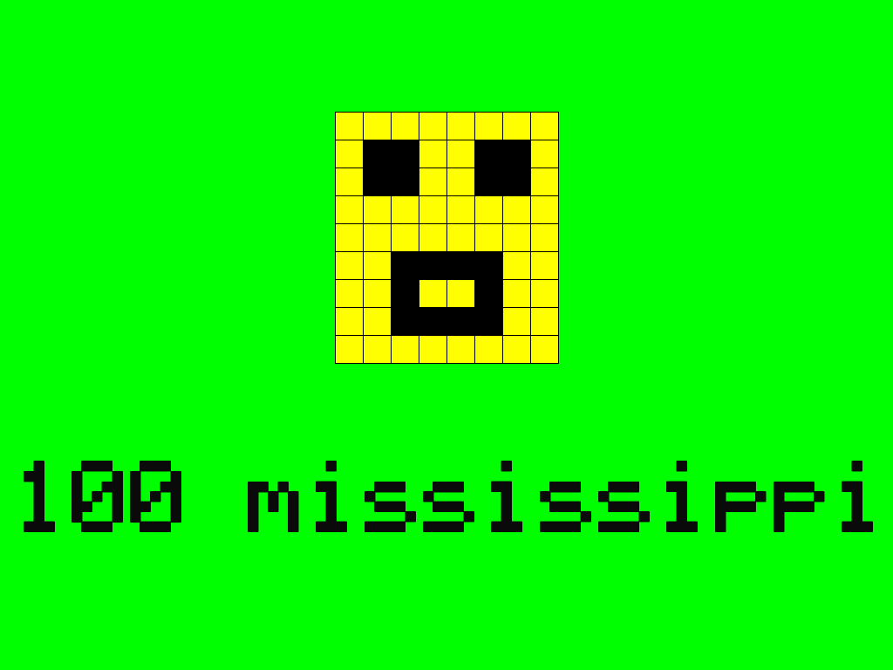

# mississippi

An "implementation" of the Lego Movie's iconic 100 Mississippi countdown, as requested by my 5 year old.

It uses Google's Text to Speech service to generate the voice.

The smiley face animation was completely specified by my son. He has drawn a face for each letter on a rectangular grid paper. I noticed that he used only 5 different face expressions, and many letters were mapped to the same face expression. However, as I've already commented in the code, the validitiy of the letter-to-face mapping is not a matter of discussion ;)

